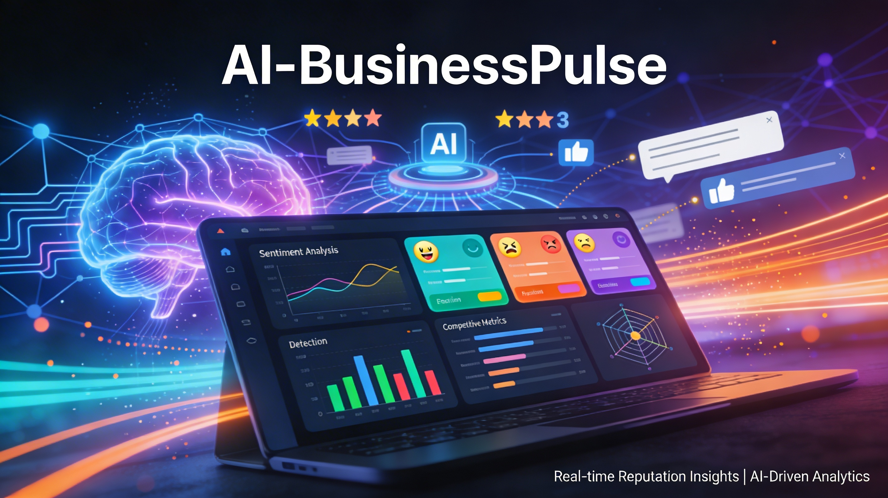

<div align="center">

🇫🇷 [Version française](#french) | 🇬🇧 [English version](#english)

</div>

---

<a name="french"></a>

<div align="center">

# 🧠 AI-BusinessPulse

### Plateforme d'Intelligence de Réputation d'Entreprise propulsée par l'IA

[](https://github.com/thierrymaesen/AI-BusinessPulse/actions/workflows/ci.yml)
[](https://python.org)
[](https://streamlit.io)
[](https://plotly.com)
[](https://pandas.pydata.org)
[](https://numpy.org)
[](https://textblob.readthedocs.io)
[](https://matplotlib.org)
[](https://opensource.org/licenses/MIT)
[]()
[](http://makeapullrequest.com)

*Analysez vos avis clients, détectez les émotions, générez des réponses automatiques, comparez-vous à la concurrence et prédisez vos tendances de réputation — le tout propulsé par l'Intelligence Artificielle.*

</div>

---



## 🚀 Essayer en ligne (Démo live)

Vous pouvez tester **AI-BusinessPulse** directement dans votre navigateur, sans rien installer :

👉 **[Lancer AI-BusinessPulse sur Streamlit](https://ai-businesspulse-thierrymaesen.streamlit.app/)**


---

## 📸 Captures d'écran / Screenshots

### 📊 Dashboard Principal — KPIs et Vue d'ensemble
Le tableau de bord principal affiche les indicateurs clés de performance : note moyenne, nombre total d'avis, pourcentage d'avis positifs/négatifs, et nombre de sources agrégées.

*The main dashboard displays key performance indicators: average rating, total reviews, positive/negative review percentages, and number of aggregated sources.*


### 📈 Répartition des Avis par Source & Distribution des Notes
Visualisez la répartition de vos avis entre les différentes plateformes (Google, Yelp, Facebook, Trustpilot, TripAdvisor) et la distribution des notes de 1 à 5 étoiles.

*View the distribution of your reviews across platforms (Google, Yelp, Facebook, Trustpilot, TripAdvisor) and the rating distribution from 1 to 5 stars.*


### 📅 Volume d'Avis par Mois (12 derniers mois)
Suivez l'évolution du volume de vos avis clients mois par mois sur les 12 derniers mois pour identifier les tendances saisonnières.

*Track the evolution of your customer review volume month by month over the last 12 months to identify seasonal trends.*


### 🎭 Analyse de Sentiment & Détection d'Émotions
L'IA analyse chaque avis pour détecter les émotions dominantes (Joie, Neutre, Colère, Tristesse, Dégoût) et la distribution globale des sentiments (Positif, Négatif, Neutre).

*The AI analyzes each review to detect dominant emotions (Joy, Neutral, Anger, Sadness, Disgust) and the overall sentiment distribution (Positive, Negative, Neutral).*


### 🗺️ Carte des Sentiments (Polarité vs Subjectivité)
Visualisez la carte interactive des sentiments qui positionne chaque avis selon sa polarité (-1 à +1) et sa subjectivité (0 à 1), coloré par émotion détectée.

*View the interactive sentiment map that positions each review by polarity (-1 to +1) and subjectivity (0 to 1), colored by detected emotion.*


### 💬 Générateur de Réponses Automatiques IA
L'IA génère des réponses personnalisées et professionnelles pour chaque avis client en attente, avec détection automatique du sentiment et de l'émotion.

*The AI generates personalized and professional responses for each pending customer review, with automatic sentiment and emotion detection.*


### 🎯 Radar Concurrentiel Multi-Axes
Comparez votre entreprise avec vos concurrents sur 6 axes stratégiques : Qualité-Prix, Réactivité, Satisfaction, Innovation, Présence Online et Fidélité.

*Compare your business with competitors across 6 strategic axes: Value for Money, Responsiveness, Satisfaction, Innovation, Online Presence, and Loyalty.*


### 📊 Tableau Comparatif & Forces/Faiblesses
Tableau détaillé avec code couleur comparant les scores sur chaque axe, accompagné d'une analyse IA identifiant vos points forts et axes d'amélioration.

*Detailed color-coded table comparing scores on each axis, accompanied by an AI analysis identifying your strengths and areas for improvement.*


### 🔮 Prédiction de Tendances de Réputation
Visualisez l'évolution historique de votre note moyenne et les prédictions IA sur les prochains mois, avec intervalle de confiance.

*View the historical evolution of your average rating and AI predictions for the coming months, with confidence interval.*


### 💡 Recommandations IA pour Améliorer votre Réputation
L'IA analyse les tendances et génère des recommandations personnalisées : tendance globale, note prédite, et actions concrètes à mettre en place.

*The AI analyzes trends and generates personalized recommendations: overall trend, predicted rating, and concrete actions to implement.*


---

## 🎯 Problème Résolu

Les entreprises reçoivent des **centaines d'avis clients** chaque mois sur **différentes plateformes** (Google, Trustpilot, Facebook, Yelp...). Gérer manuellement cette masse de retours est :

- ⏰ **Chronophage** : Lire et analyser chaque avis prend des heures
- 😵 **Complexe** : Difficile de dégager des tendances à partir de données dispersées
- 💬 **Frustrant** : Répondre individuellement à chaque avis de manière professionnelle est épuisant
- 🔍 **Aveugle** : Impossible de se comparer objectivement aux concurrents
- 🔮 **Réactif** : Les entreprises réagissent aux problèmes au lieu de les anticiper

**AI-BusinessPulse** résout tous ces problèmes en une seule plateforme intelligente ! 🚀

---

## ✨ 5 Fonctionnalités Originales

### 1. 📊 Agrégateur Multi-Sources d'Avis
Centralisez tous vos avis clients en un seul tableau de bord. Collecte les avis de **5 plateformes** : Google Reviews, Trustpilot, Facebook, Yelp, TripAdvisor. Dashboard interactif avec graphiques en temps réel.

### 2. 🎭 Analyse Profonde de Sentiment & Détection d'Émotions
Comprenez ce que ressentent vraiment vos clients. Analyse de sentiment via **TextBlob NLP** et détection de **7 émotions** : Joie 😊, Colère 😠, Tristesse 😢, Peur 😨, Dégoût 🤢, Surprise 😲, Neutre 🤔.

### 3. 💬 Générateur de Réponses Automatiques IA
Répondez professionnellement à chaque avis en un clic. Génération de réponses **personnalisées** selon le sentiment détecté.

### 4. 🎯 Radar Concurrentiel de Réputation
Comparez-vous objectivement à vos concurrents avec un **spider chart** interactif sur 6 axes.

### 5. 🔮 Prédiction de Tendances de Réputation
Anticipez l'avenir de votre réputation avec la **régression linéaire** sur les données historiques et des prédictions sur **3 à 12 mois**.

---

## 🚀 Démarrage Rapide

### Prérequis

- **Python 3.9+** installé sur votre machine
- **pip** (gestionnaire de paquets Python)
- **Git** pour cloner le repository

### Installation en 3 étapes

```bash
# 1. Cloner le repository
git clone https://github.com/thierrymaesen/AI-BusinessPulse.git
cd AI-BusinessPulse

# 2. Installer les dépendances
pip install -r requirements.txt

# 3. Lancer l'application
streamlit run app.py
```

L'application s'ouvre automatiquement dans votre navigateur à l'adresse : `http://localhost:8501`

---

## 🏗️ Structure du Projet

```
AI-BusinessPulse/
├── app.py                # Application principale Streamlit
├── requirements.txt      # Dépendances Python
├── README.md             # Documentation complète
├── LICENSE               # Licence MIT
├── .gitignore            # Fichiers à ignorer
└── .streamlit/
    └── config.toml       # Configuration du thème Streamlit
```

---

## 🛠️ Technologies Utilisées

| Technologie | Usage | Pourquoi ? |
|-------------|-------|------------|
| **Python 3.9+** | Langage principal | Écosystème IA/ML riche |
| **Streamlit** | Interface web | Prototypage rapide, interactif |
| **TextBlob** | Analyse de sentiment | NLP simple et efficace |
| **Plotly** | Graphiques interactifs | Graphiques professionnels |
| **Pandas** | Manipulation de données | Standard de l'industrie |
| **NumPy** | Calculs numériques | Régression linéaire |
| **Matplotlib** | Colormaps & styles | Requis par Pandas Styler |

---

## 🤝 Contribuer

Les contributions sont les bienvenues !

1. **Fork** le projet
2. Créez votre branche (`git checkout -b feature/NouvelleFeature`)
3. Committez vos changements (`git commit -m 'Ajout NouvelleFeature'`)
4. Pushez sur la branche (`git push origin feature/NouvelleFeature`)
5. Ouvrez une **Pull Request**

---

## 👨‍💻 Auteur

**Thierry Maesen** — Consultant IA & Automatisation | n8n & Agents IA | WordPress

- 🌐 [GitHub](https://github.com/thierrymaesen)
- 📍 Belgique

---

## 📄 Licence

Ce projet est sous licence **MIT** — voir le fichier [LICENSE](LICENSE) pour plus de détails.

---

<div align="center">

**⭐ Si ce projet vous plaît, n'hésitez pas à lui donner une étoile !**

*Fait avec ❤️ et 🧠 par Thierry Maesen*

</div>

---

<a name="english"></a>

<div align="center">

# 🧠 AI-BusinessPulse

### AI-powered Business Reputation Intelligence Platform

[](https://github.com/thierrymaesen/AI-BusinessPulse/actions/workflows/ci.yml)
[](https://python.org)
[](https://streamlit.io)
[](https://plotly.com)
[](https://pandas.pydata.org)
[](https://numpy.org)
[](https://textblob.readthedocs.io)
[](https://matplotlib.org)
[](https://opensource.org/licenses/MIT)
[]()
[](http://makeapullrequest.com)

*Analyze your customer reviews, detect emotions, generate automatic responses, benchmark against competitors and predict your reputation trends — all powered by Artificial Intelligence.*

</div>

---

## 🚀 Try it online (Live Demo)

You can test **AI-BusinessPulse** directly in your browser, no installation required:

👉 **[Launch AI-BusinessPulse on Streamlit](https://ai-businesspulse-thierrymaesen.streamlit.app/)**


---

## 📸 Screenshots

> 📷 See the [Screenshots section above](#-captures-décran--screenshots) for detailed screenshots with bilingual descriptions (FR/EN).
> 
> 📷 Consultez la [section Captures d'écran ci-dessus](#-captures-décran--screenshots) pour les captures d'écran détaillées avec descriptions bilingues (FR/EN).

---

## 🎯 Problem Solved

Businesses receive **hundreds of customer reviews** every month across **different platforms** (Google, Trustpilot, Facebook, Yelp...). Manually managing this volume of feedback is:

- ⏰ **Time-consuming**: Reading and analyzing each review takes hours
- 😵 **Complex**: Hard to identify trends from scattered data
- 💬 **Frustrating**: Responding individually to each review professionally is exhausting
- 🔍 **Blind**: Impossible to objectively compare yourself to competitors
- 🔮 **Reactive**: Businesses react to problems instead of anticipating them

**AI-BusinessPulse** solves all these problems in a single intelligent platform! 🚀

---

## ✨ 5 Original Features

### 1. 📊 Multi-Source Review Aggregator
Centralize all your customer reviews in a single dashboard. Collects reviews from **5 platforms**: Google Reviews, Trustpilot, Facebook, Yelp, TripAdvisor. Interactive dashboard with real-time charts.

### 2. 🎭 Deep Sentiment Analysis & Emotion Detection
Understand what your customers really feel. Sentiment analysis via **TextBlob NLP** and detection of **7 emotions**: Joy 😊, Anger 😠, Sadness 😢, Fear 😨, Disgust 🤢, Surprise 😲, Neutral 🤔.

### 3. 💬 AI Automatic Response Generator
Respond professionally to each review in one click. Generation of **personalized** responses based on the detected sentiment.

### 4. 🎯 Competitive Reputation Radar
Objectively compare yourself to your competitors with an interactive **spider chart** across 6 axes.

### 5. 🔮 Reputation Trend Prediction
Anticipate the future of your reputation with **linear regression** on historical data and predictions over **3 to 12 months**.

---

## 🚀 Quick Start

### Prerequisites

- **Python 3.9+** installed on your machine
- **pip** (Python package manager)
- **Git** to clone the repository

### Installation in 3 steps

```bash
# 1. Clone the repository
git clone https://github.com/thierrymaesen/AI-BusinessPulse.git
cd AI-BusinessPulse

# 2. Install dependencies
pip install -r requirements.txt

# 3. Launch the application
streamlit run app.py
```

The application opens automatically in your browser at: `http://localhost:8501`

---

## 🏗️ Project Structure

```
AI-BusinessPulse/
├── app.py                # Main Streamlit application
├── requirements.txt      # Python dependencies
├── README.md             # Complete documentation
├── LICENSE               # MIT License
├── .gitignore            # Files to ignore
└── .streamlit/
    └── config.toml       # Streamlit theme configuration
```

---

## 🛠️ Technologies Used

| Technology | Usage | Why? |
|------------|-------|------|
| **Python 3.9+** | Main language | Rich AI/ML ecosystem |
| **Streamlit** | Web interface | Rapid prototyping, interactive |
| **TextBlob** | Sentiment analysis | Simple and effective NLP |
| **Plotly** | Interactive charts | Professional graphics |
| **Pandas** | Data manipulation | Industry standard |
| **NumPy** | Numerical computations | Linear regression |
| **Matplotlib** | Colormaps & styles | Required by Pandas Styler |

---

## 🤝 Contributing

Contributions are welcome!

1. **Fork** the project
2. Create your branch (`git checkout -b feature/NewFeature`)
3. Commit your changes (`git commit -m 'Add NewFeature'`)
4. Push to the branch (`git push origin feature/NewFeature`)
5. Open a **Pull Request**

---

## 👨‍💻 Author

**Thierry Maesen** — AI & Automation Consultant | n8n & AI Agents | WordPress

- 🌐 [GitHub](https://github.com/thierrymaesen)
- 📍 Belgium

---

## 📄 License

This project is licensed under the **MIT** License — see the [LICENSE](LICENSE) file for details.

---

<div align="center">

**⭐ If you like this project, feel free to give it a star!**

*Made with ❤️ and 🧠 by Thierry Maesen*

</div>
